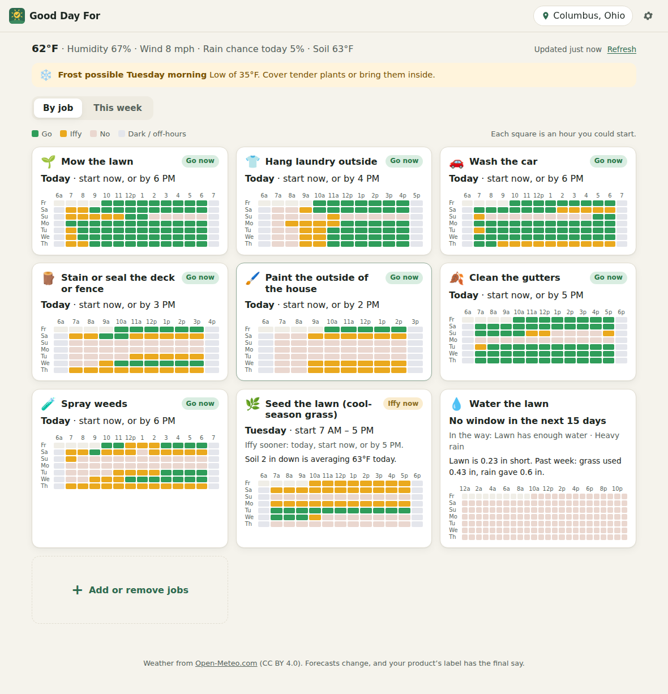
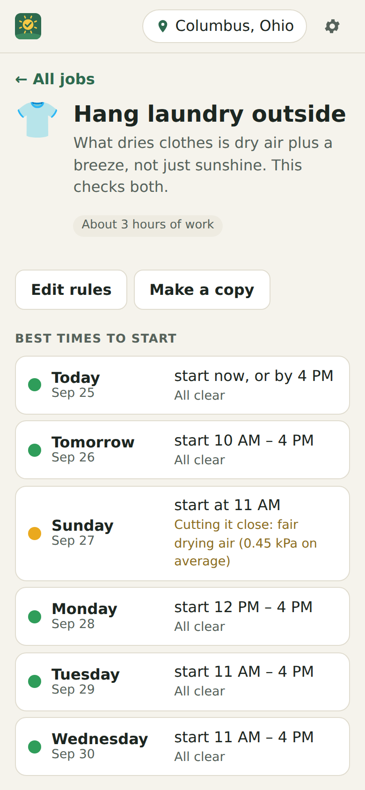
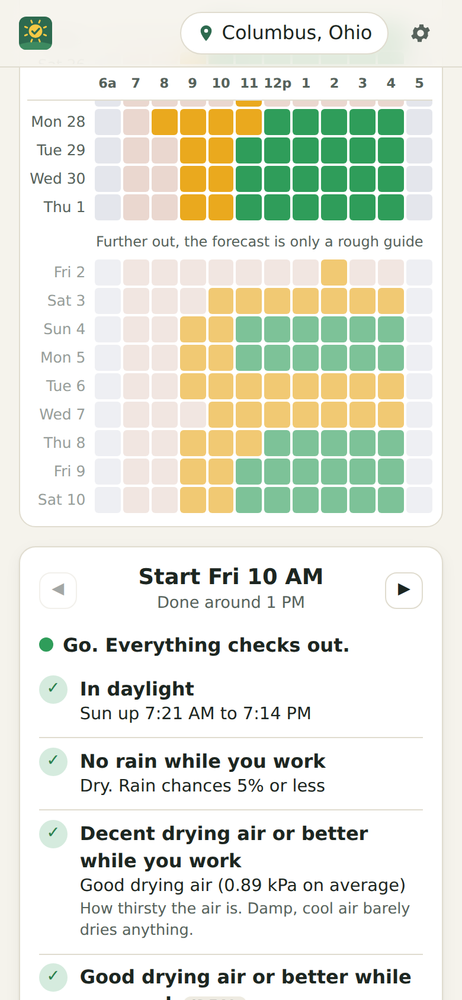
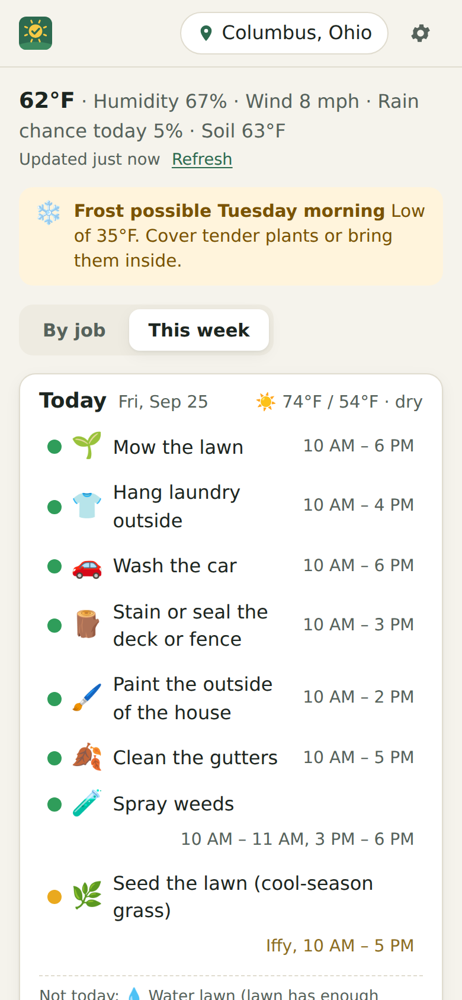

# Good Day For

**Is it a good day to stain the deck?** Weather apps tell you the weather. What you actually want to know is whether you can do the job. Every outdoor job has its own rules, and most of them reach past today:

- Deck stain: dry wood going in, no rain for 12–24 hours after, 50–90°F, warm enough overnight to cure.
- Exterior latex paint: at or above 50°F for the next 24 hours, 5°F above the dew point so dew doesn't land on wet paint, humidity under 85%.
- Driveway sealer: 50°F and staying there for a day, 24 hours dry.
- Weed killer: wind under 10 mph, under 85°F, 6 dry hours to soak in.
- Grass seed: soil between 50°F and 65°F two inches down, and no downpour to wash it away.

Checking all that yourself means scrolling an hourly forecast and doing arithmetic in your head. Good Day For does the scrolling. You pick your jobs, and for every hour in the next 16 days it checks whether starting then keeps every rule for the whole job, including the drying and curing time after. Then it shows you the windows.

<p align="center">
  
</p>

<p align="center">
  
  &nbsp;
  
  &nbsp;
  
</p>

<sub>Screenshots use a made-up sample forecast.</sub>

## What it does

- **28 jobs out of the box** across lawn, garden, paint and stain, driveway and concrete, roof and gutters, and laundry and car. Each one comes with typical label and extension limits.
- **Green, amber, grey.** Green means go. Amber means it meets the minimums but it's close to a limit, has a 30–50% chance of rain, or misses an ideal. Grey-pink means a must-have fails. Night and off-hours are shown separately, so "it's dark" doesn't look like "it's raining".
- **Shows why.** Tap any hour and every rule is listed with what the forecast actually shows, for example "Low of 44°F Sun 6 AM" or "40% chance of rain Wed 7 AM".
- **Every hour labeled.** The grids show only the hours a job could start (a daylight job skips the night), so the squares are bigger. The hour labels along the top stay put while you scroll.
- **This week view.** Day by day: what you can get done today, what you can do Saturday, and what's ruled out and why.
- **Fits your week.** Tell it you're free evenings and weekends, and 10 AM Tuesday stops counting. Jobs that run themselves, like the sprinkler, ignore this.
- **Lawn watering by the numbers.** It keeps a running water balance. Grass uses about 80% of the day's evapotranspiration, and rain puts water back. It only says to water when the lawn is actually short and no real rain is coming.
- **Soil temperature** drives the grass seed, crabgrass preventer and bulb jobs.
- **Heads-up alerts** for frost, hard freeze, freezing rain, snow, heavy rain, strong gusts and heat, each with the thing to do about it.
- **Your rules.** Every number is editable. Mark a rule Must, Ideal or Bonus, or build a job from scratch. Some examples: a low-temperature paint that's fine down to 35°F, or "walk the dog" as dry and under 85°F.
- **Add to calendar** as an .ics file or a Google Calendar link, with a reminder the evening before to check the forecast again.
- No account and no server. Your list, rules and place stay in your browser. It works offline from the last forecast, and you can install it to a phone's home screen.

## How it decides

Each job is its length in hours plus a list of rules. A rule checks one thing over a stretch of time measured from when you'd start:

| Rule | Example |
|---|---|
| No rain | while you work and for 12 hours after |
| At least / no hotter than | 50°F while you work and for 24 hours after |
| Wind or gusts under | 10 mph while you work |
| Humidity under, dew point under, above the dew point by | 85%, 60°F, 5°F |
| Rain total under or at least | less than 1 in in the 48 hours after |
| Soil temperature | 2 in down, between 50°F and 65°F (daily average) |
| Drying air | vapour-pressure deficit, which is what actually dries laundry and paint |
| Cloud cover | windows are best washed when it's cloudy |
| Lawn short on water | the running water balance |
| Daylight, time of day | sprinklers from 4 to 10 AM |

A start hour is **go** if every rule passes comfortably and **iffy** if a must-rule is within a hair of its limit (about 3°F, 5% humidity, or a 30–50% rain chance) or an ideal-rule fails. It's **no** if any must-rule fails. Back-to-back usable hours become the windows you see.

Rain counts as "likely" at 60% and a "chance" at 30%, the same as the National Weather Service's wording. For hours that already happened, only rain that actually fell counts.

The weather comes from [Open-Meteo](https://open-meteo.com/) (free, no key, CC BY 4.0): 7 days back and 16 ahead, hourly. Past about a week the forecast is a rough guide, and the page fades those days to say so.

**The label wins.** The built-in limits are typical guidance, not your product's instructions. Forecasts change, so check again the day before.

## Running it

It's a static site: plain HTML, CSS and JavaScript modules, with no build step.

```sh
npx serve .        # or any static file server, then open the printed address
npm test           # rules engine, wording and calendar tests (Node 20+)
node test/e2e.mjs  # drives the real page in Chromium against a sample forecast (needs Playwright)
```

To put it online with GitHub Pages: **Settings → Pages → Build and deployment → Deploy from a branch**, then pick the branch and `/ (root)`.

### Files

- `js/engine.js`: the rules engine. It's pure functions that take the forecast in and give a rating per start hour back, and it knows nothing about the page.
- `js/jobs.js`: the job catalog. Adding a job means adding an entry here.
- `js/text.js`: turns rules and forecast values into sentences, in either unit system.
- `js/weather.js`: Open-Meteo forecast and place search.
- `js/app.js`: the page.
- `js/store.js`, `js/cal.js`, `js/units.js`: saved settings, calendar export and unit conversion.
- `test/fixture.js`: a realistic made-up forecast built around today's date, used by the tests.
