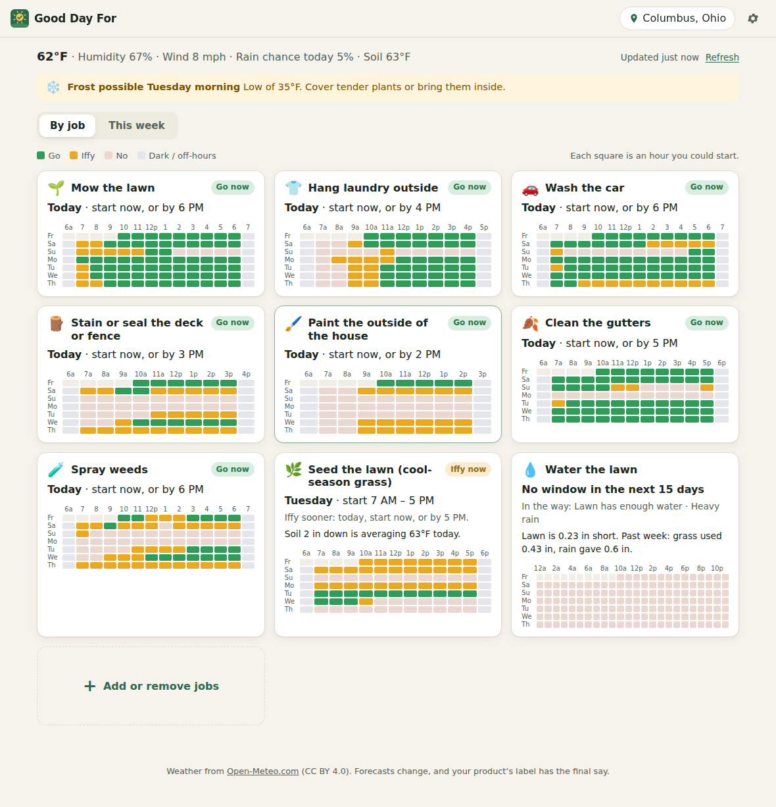
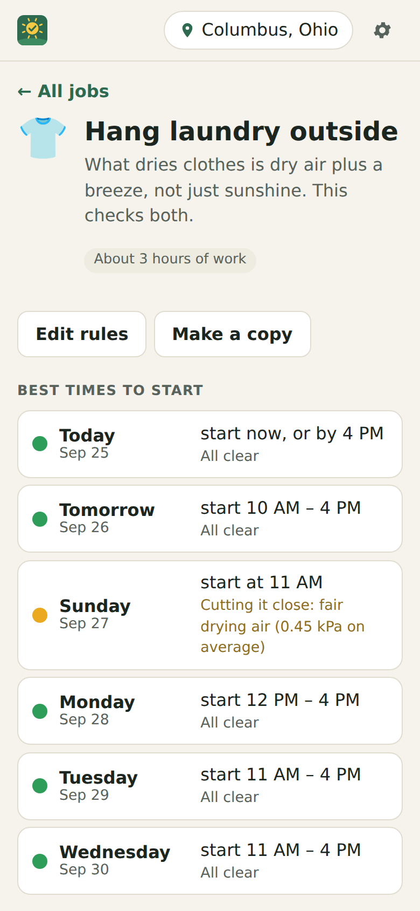
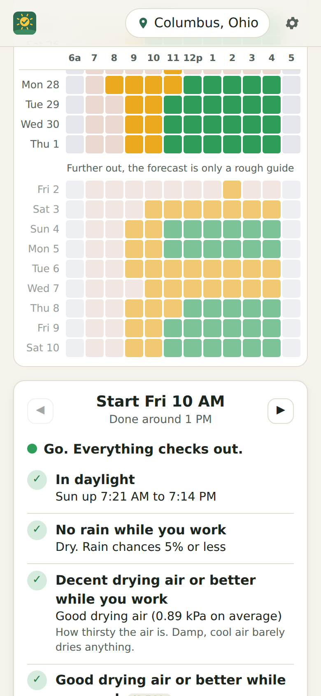
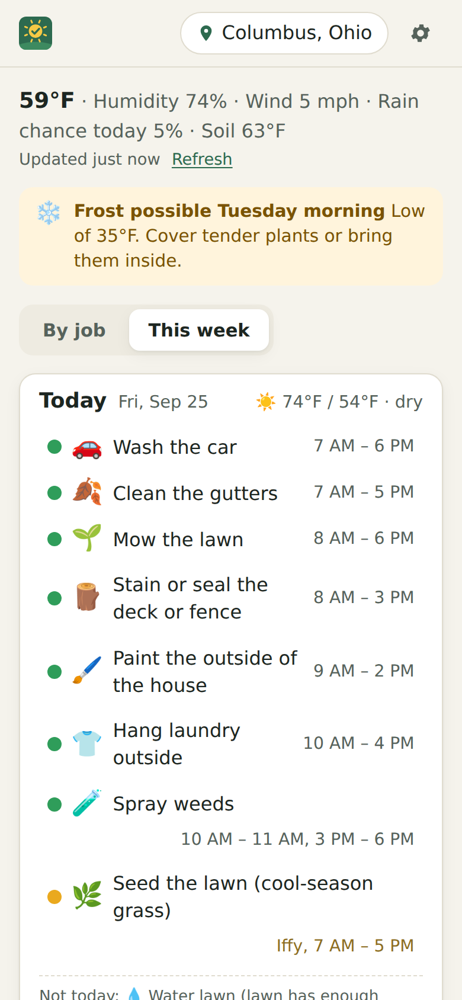
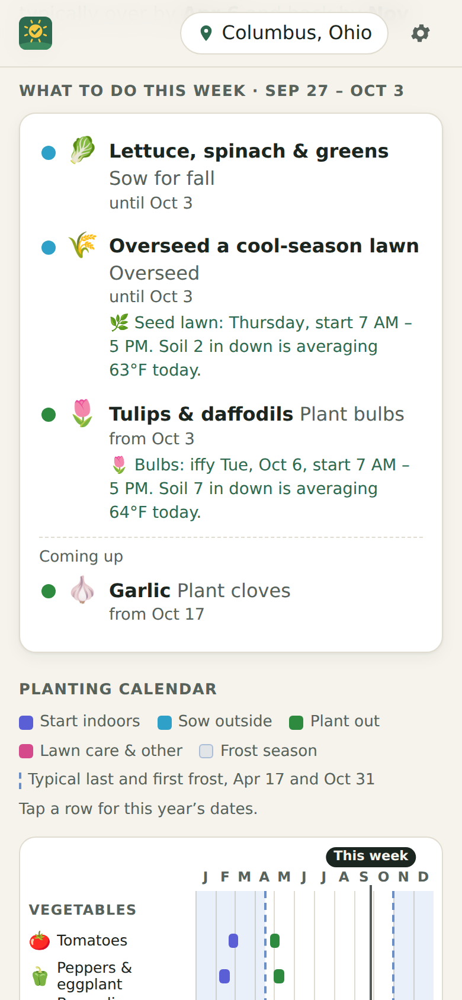
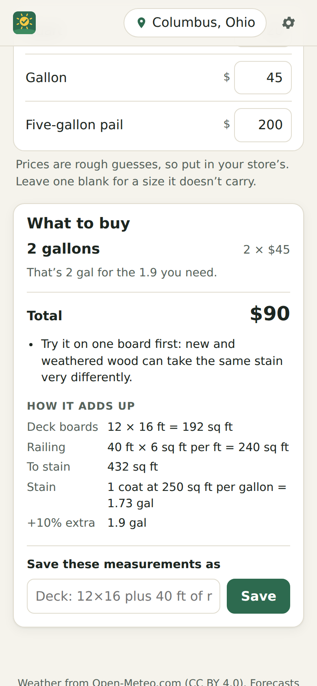

# Good Day For

**Use it: [good-day-for.junkdrawer.works](https://good-day-for.junkdrawer.works/)**

**Is it a good day to stain the deck?** Weather apps tell you the weather. What you actually want to know is whether you can do the job. Every outdoor job has its own rules, and most of them reach past today:

- Deck stain: dry wood going in, no rain for 12–24 hours after, 50–90°F, warm enough overnight to cure.
- Exterior latex paint: at or above 50°F for the next 24 hours, 5°F above the dew point so dew doesn't land on wet paint, humidity under 85%.
- Driveway sealer: 50°F and staying there for a day, 24 hours dry.
- Weed killer: wind under 10 mph, under 85°F, 6 dry hours to soak in.
- Grass seed: soil between 50°F and 65°F two inches down, and no downpour to wash it away.

Checking all that yourself means scrolling an hourly forecast and doing arithmetic in your head. Good Day For does the scrolling. You pick your jobs, and for every hour in the next 16 days it checks whether starting then keeps every rule for the whole job, including the drying and curing time after. Then it shows you the windows.

Two more things round out the job. **How much to buy** turns your measurements into the cans and bags to pick up, with a total. **Planting** works out your frost dates from 30 years of weather at your spot and hangs a planting calendar on them.

<p align="center">
  
</p>

<p align="center">
  
  &nbsp;
  
  &nbsp;
  
</p>

<p align="center">
  
  &nbsp;
  
</p>

<sub>Screenshots use a made-up sample forecast and weather history.</sub>

## What it does

- **28 jobs out of the box** across lawn, garden, paint and stain, driveway and concrete, roof and gutters, and laundry and car. Each one comes with typical label and extension limits.
- **Green, amber, grey.** Green means go. Amber means it meets the minimums but it's close to a limit, has a 30–50% chance of rain, or misses an ideal. Grey-pink means a must-have fails. Night and off-hours are shown separately, so "it's dark" doesn't look like "it's raining".
- **Shows why.** Tap any hour and every rule is listed with what the forecast actually shows, for example "Low of 44°F Sun 6 AM" or "40% chance of rain Wed 7 AM".
- **Every hour labeled.** The grids show only the hours a job could start (a daylight job skips the night), so the squares are bigger. The hour labels along the top stay put while you scroll.
- **This week view.** Day by day: what you can get done today, what you can do Saturday, and what's ruled out and why.
- **Fits your week.** Tell it you're free evenings and weekends, and 10 AM Tuesday stops counting. Jobs that run themselves, like the sprinkler, ignore this.
- **Lawn watering by the numbers.** It keeps a running water balance. Grass uses about 80% of the day's evapotranspiration, and rain puts water back. It only says to water when the lawn is actually short and no real rain is coming.
- **Soil temperature** drives the grass seed, crabgrass preventer and bulb jobs.
- **Heads-up alerts** for frost, hard freeze, freezing rain, snow, heavy rain, strong gusts and heat, each with the thing to do about it.
- **Your rules.** Every number is editable. Mark a rule Must, Ideal or Bonus, or build a job from scratch. Some examples: a low-temperature paint that's fine down to 35°F, or "walk the dog" as dry and under 85°F.
- **Add to calendar** as an .ics file or a Google Calendar link, with a reminder the evening before to check the forecast again.
- **How much to buy.** Paint and primer, deck and fence stain, driveway sealer, grass seed, fertilizer and crabgrass preventer, mulch, topsoil, compost, gravel and concrete. Put in the measurements and it rounds up to what the store sells (a gallon and a quart, a five-gallon pail, 80 lb bags) with a little extra, and adds up the price. It shows its working, and every coverage figure, container size and price can be changed to match your label and your store. A job's page links straight to the right calculator, and you can save measurements by name ("Deck: 12×16 plus 40 ft of railing").
- **Frost dates.** For your spot, the typical last spring frost and first fall frost, the date only 1 year in 10 goes past, the frost-free season and the hard-freeze dates, from 30 years of history. It says so when a place has no frost, or only now and then, and it works south of the equator.
- **A planting calendar** hung on those dates: when to start seeds indoors, sow, plant out and plant for fall, for 21 vegetables, herbs and flowers plus the lawn, with a "this week" line and a list of what to do now. Rows that match a job (seeding the lawn, crabgrass preventer, bulbs, planting out) show that job's verdict from the forecast too.
- No account and no server. Your list, rules and place stay in your browser. It works offline from the last forecast, and you can install it to a phone's home screen.

## How it decides

Each job is its length in hours plus a list of rules. A rule checks one thing over a stretch of time measured from when you'd start:

| Rule | Example |
|---|---|
| No rain | while you work and for 12 hours after |
| At least / no hotter than | 50°F while you work and for 24 hours after |
| Wind or gusts under | 10 mph while you work |
| Humidity under, dew point under, above the dew point by | 85%, 60°F, 5°F |
| Rain total under or at least | less than 1 in in the 48 hours after |
| Soil temperature | 2 in down, between 50°F and 65°F (daily average) |
| Drying air | vapour-pressure deficit, which is what actually dries laundry and paint |
| Cloud cover | windows are best washed when it's cloudy |
| Lawn short on water | the running water balance |
| Daylight, time of day | sprinklers from 4 to 10 AM |

A start hour is **go** if every rule passes comfortably and **iffy** if a must-rule is within a hair of its limit (about 3°F, 5% humidity, or a 30–50% rain chance) or an ideal-rule fails. It's **no** if any must-rule fails. Back-to-back usable hours become the windows you see.

Rain counts as "likely" at 60% and a "chance" at 30%, the same as the National Weather Service's wording. For hours that already happened, only rain that actually fell counts.

The weather comes from [Open-Meteo](https://open-meteo.com/) (free, no key, CC BY 4.0): 7 days back and 16 ahead, hourly. Past about a week the forecast is a rough guide, and the page fades those days to say so.

**The label wins.** The built-in limits are typical guidance, not your product's instructions. Forecasts change, so check again the day before.

### How much to buy

Each calculator turns measurements into an area or a volume, then into an amount of product, then into containers:

| Material | Amount | Typical figures (all editable) |
|---|---|---|
| Paint | walls (distance around × height, plus gable triangles; or a room's 2 × (length + width) × height) less doors and windows, × coats ÷ coverage | smooth siding 350 sq ft/gal, rough wood 250, stucco or brick 175; smooth inside walls 400, textured 300; primer 250–300; a door 21 sq ft, a window 15, a garage door 112 |
| Deck and fence stain | deck boards + railing length × surface per foot + steps × width × tread-and-riser + fence length × height × sides, × coats ÷ coverage | new wood 250 sq ft/gal, weathered 175, rough-sawn 125; railing 6 sq ft per foot; a step 1.5 ft |
| Driveway sealer | area × coats ÷ coverage per pail | newer asphalt 350 sq ft per pail, older 250; two coats |
| Grass seed | area × rate | lb per 1,000 sq ft for a new lawn or overseeding, by grass: tall fescue 7 or 4, bluegrass 2.5 or 1.5, bermuda 1.5 or 1, and so on |
| Fertilizer, crabgrass preventer | area × times this year, in bags sold by the area they cover | 5,000 and 15,000 sq ft bags |
| Mulch, topsoil, compost, gravel | area (rectangle, circle or known) × depth, in cubic feet and yards | 3 in of mulch, 4 of topsoil, 2 of compost, 3 of gravel; bags of 2, 1.5 and 0.5 cu ft, or loose by the half yard |
| Concrete | slab area × thickness, or post holes less the post | 40, 60 and 80 lb bags making 0.30, 0.45 and 0.60 cu ft, or ready-mix by the quarter yard |

Then it adds a small allowance (10% for paint and stain, 5–10% for the rest, shown with the reason) and picks the **cheapest mix of containers that covers it**, preferring less left over when prices tie. That's why 4.2 gallons of paint comes out as four gallons and a quart but 4.3 as a five-gallon pail. Leave a price blank and that size is left out. Metric works the same way with square metres, litres, kilograms and cubic metres, and its own container sizes and prices, since a 2.5 L tin isn't a converted gallon.

### Frost dates and the planting calendar

The first time you open Planting for a place, it downloads the daily low for the last 30 complete years from [Open-Meteo's historical weather archive](https://open-meteo.com/en/docs/historical-weather-api) (about 11,000 numbers). For each year it finds the last night in spring and the first night in fall at or below 32°F (a frost) and 28°F (a hard freeze). The **typical** date is the median year. **1 year in 10** is the 90th percentile for the last frost and the 10th for the first. The frost-free season is the days between them. Years run midwinter to midwinter (January to December in the north, July to June in the south, split at August 1 or February 1), so a southern winter isn't cut in half by New Year. A year with no frost counts as earlier than any date, not as missing. Only the summaries are kept, per place, and they're worked out again once a new year of history is in.

It's honest about what that history is. The data is a reanalysis, a weather model re-run over the past on a grid roughly 10 to 25 km across, not a thermometer in your yard. Low spots and valleys frost later in spring and earlier in fall, and the numbers are for air 2 m up, not the grass. The page says so.

The calendar counts weeks from the typical dates, following common extension-service advice: tomatoes are started indoors 8 to 6 weeks before the last frost and planted out 1 to 3 weeks after, garlic goes in from 2 weeks before the first frost to 3 after, and so on. Lawn and bulb rows only set the season. The matching job's soil-temperature rule picks the day, and the calendar shows that job's verdict next to the row.

## Running it

It's a static site: plain HTML, CSS and JavaScript modules, with no build step.

```sh
npx serve .        # or any static file server, then open the printed address
npm test           # rules engine, wording, calendar export, materials and frost tests (Node 20+)
node test/e2e.mjs  # drives the real page in Chromium against a sample forecast and history (needs Playwright)
```

To put it online with GitHub Pages: **Settings → Pages → Build and deployment → Deploy from a branch**, then pick the branch and `/ (root)`.

### Files

- `js/engine.js`: the rules engine. It's pure functions that take the forecast in and give a rating per start hour back, and it knows nothing about the page.
- `js/jobs.js`: the job catalog. Adding a job means adding an entry here.
- `js/text.js`: turns rules and forecast values into sentences, in either unit system.
- `js/materials.js`: how much to buy. It has the calculators, their typical figures, and the container rounding.
- `js/frost.js`: frost dates from the weather history. Like the engine, it's pure functions.
- `js/planting.js`: the planting calendar, as weeks either side of the frost dates.
- `js/weather.js`: Open-Meteo forecast, weather history and place search.
- `js/app.js`: the page.
- `js/store.js`, `js/cal.js`, `js/units.js`: saved settings and frost dates, calendar export, and unit conversion.
- `test/fixture.js`: a realistic made-up forecast built around today's date, and a made-up weather history with frost dates you choose, used by the tests.
